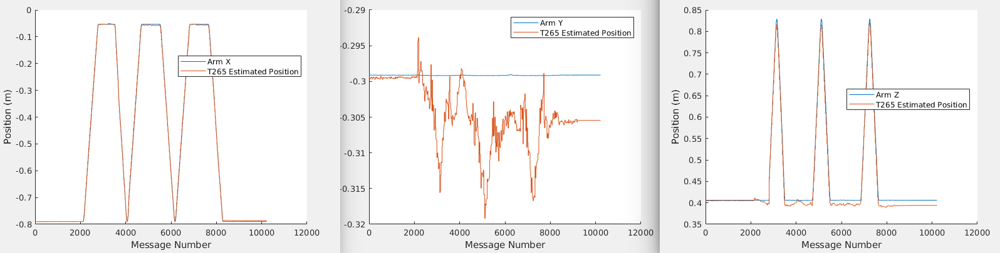
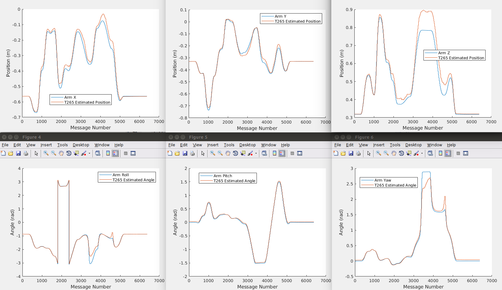
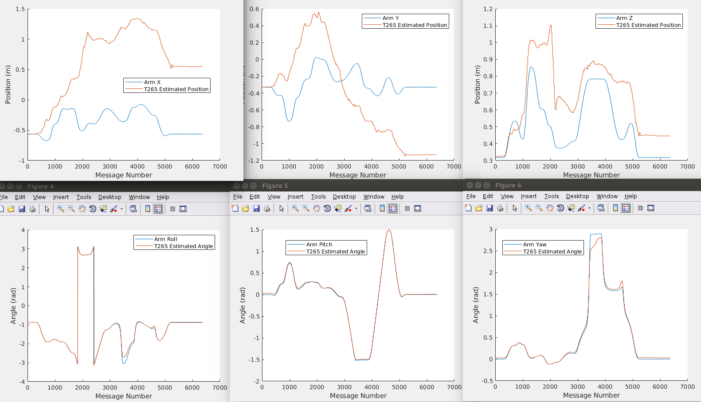

# Testing the Realsense T265 Accuracy
Some brief results of tracking accuracy tests that I ran with the Realsense T265 V-SLAM camera

In June 2019 I ran some tests of the T265 mounted to a UR5 robotic arm, trying to assess the accuracy of this camera. As of writing I could not find any actual figures on how well the tracking of this camera performs, Intel mentions a *generous* figure of 1 percent in one of their support responses [here](https://www.intel.com/content/www/us/en/support/articles/000032899/emerging-technologies/intel-realsense-technology.html). 

## Experiment Setup
To get a ground truth I have a UR5 cobot arm mounted to a table in a lab setting. There is plenty of texture and good lighting for the T265 to operate with. 

The arm is controlled through ROS using the ur_modern_driver low bandwidth trajectory follower. See my other repo for details on this https://github.com/jaspereb/UR5_With_ROS_Moveit_Tutorial. The T265 is run using the default ROS launch files provided by https://github.com/IntelRealSense/realsense-ros so all of the image settings are left untouched from these. 

The T265 is mounted to the end of the arm using a 3D printed plate, approximately 60mm deep from the mounting point. This introduces a small amount of flex (<1mm in position). Prior to starting, the end effector (camera) is placed in a pose with zero roll and pitch so that the T265 odometry frame can be aligned with the world frame using only data from the CAD files of the robot, camera and mounting bracket. 

I construct the /tf tree in ROS so that there is a `world->t265_link` transform which is the camera position built using the camera odometry, as well as a `world->t265_link_from_arm` transform which is the camera position built using the arm encoders. You can check the full /tf tree [here](frames.pdf).

After setting up the /tf tree the arm is run through 2 trajectories. The first is a cartesian one, moving along the x axis then the z axis (in an L shape). The second is a random trajectory with complicated orientation changes. For a final experiment I run the complicated trajectory again, but with the cameras on the T265 completely covered, to test how good the IMU is. Both paths are run at 100% of the default speed of the UR5 so these are roughly as fast as a human moves when completing repetitive motions.

The cartesian path takes a total of 47.5s and the random path takes 28.5s.

Each of these 3 experiments is recorded into a ROS bag. This is played into matlab where the `world->t265_link` and `world->t265_link_from_arm` are converted into X-Y-Z-Roll-Pitch-Yaw matrices called `camPose` and `armPose` respectively. The position coordinates are in meters, and the orientation is in radians and is converted using the `quat2eul` function. 

## Results Files
For each of the 3 experiments, a .mat file is provided (in this repository, click the ‘View on GitHub’ button if you are on the Github Pages site). You can also use scipy.io to open these. A raw ROS bag of the /tf messages for each experiment is also provided.

Overall the performance was not quite as good as I expected, showing errors of up to 10cm for periods of high acceleration. However the VSLAM loop closure does work and the tracking is good for periods of constant velocity, so long term drift should not be a problem in small environments.  

Basic plots of the results are below:
### Experiment 1: Cartesian Path

Note there are different axes scales.

### Experiment 2: Random Path

### Experiment 1: Random Path and Blind

The angle tracking works fine as the gravity vector can be used to resolve orientation over time (provided it is not constantly orthogonal to one of the axes). The position tracking suffers from severe drift, showing how important the visual loop closure is. 

## Caveats
Some limitations/considerations of this experiment 

-It is in a static environment with good lighting and texture, there are no moving objects in the frame.

-The /tf chain will not be perfect, but calibration errors should be <1mm

-This is on a smooth robot arm, bouncy platforms will perform worse 
